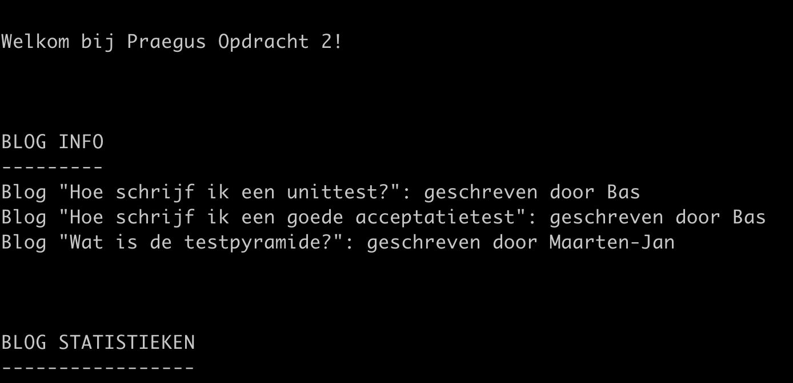

# Opdracht 2: Java

Deze opdracht bevat een opzet voor een Java-applicatie met bijbehorende Junit5-unittests.

## Bouwen Applicatie
Om deze applicatie te draaien heb je Java 11 nodig op je systeem (en een IDE zoals IntelliJ)

Java-installatie: 
Voor de installatie op windows is het van belang dat we de JAVA_HOME environment variabele zetten. 
Om dit makkelijk te maken hebben wij gekozen voor de installatie van Java middels OpenJDK.
Ga hiervoor naar https://adoptopenjdk.net

Kies daar voor de OpenJDK versie (versie 11)

Controleer of de installatie gelukt is door een nieuwe terminal te starten:

Voer hiervoor het volgende commando's in een cmd-window:
```
java -version
javac -version
```
Check dat beide commando's versie 11 teruggeven als Major versie.  


Draai het volgende commando om de applicatie te bouwen en te unittesten:
#### Windows
```
mvnw clean test
```

#### Linux / Mac
```
./mvnw clean test
```


En draai de applicatie zelf door het volgende commando uit te voeren:
#### Windows
```
mvnw clean package exec:exec
```

#### Linux / Mac
```
./mvnw clean package exec:exec
```
Als het goed is zie je dan het volgende op het scherm:


# Inhoud project
Het project bevat twee source-packages: junit en opdracht2.
de package junit bevat een voorbeeld van een unittest opgezet met JUnit 5.
de package nl.praegus.opdracht2 bevat de code voor de opdracht. De main-class van de applicatie
is *nl.praegus.opdracht2.MyApp*.

# Opdrachtomschrijving
Je bent nu klaar om aan de opdracht te beginnen: [Opdrachtomschrijving](OPDRACHT.md)
